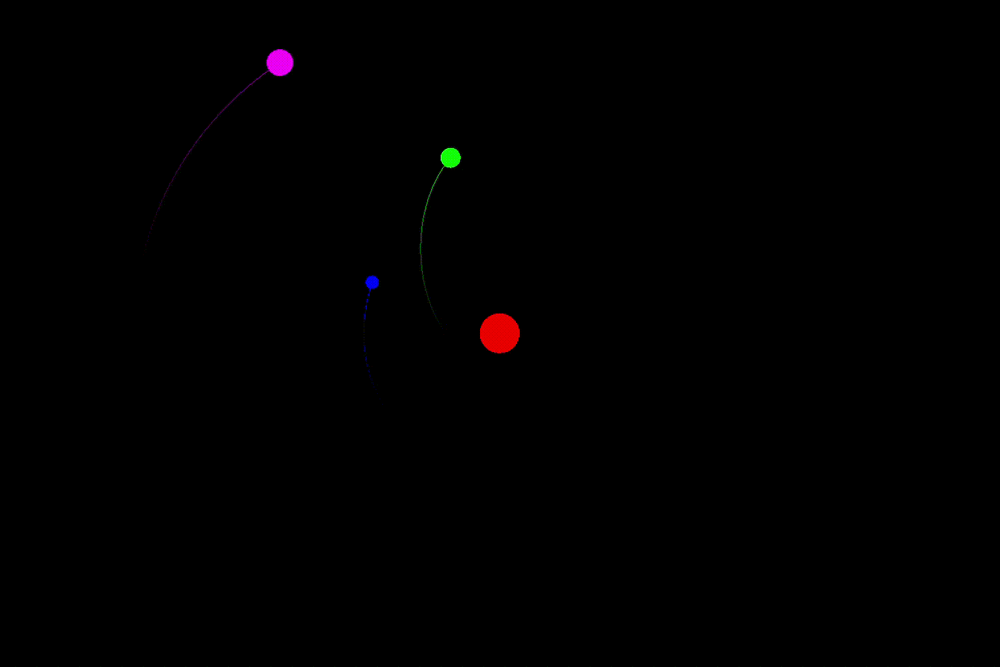

# solar-system-model

Simulating the movement of planetary bodies based on the law of gravitation.

Planets are declared in main.cpp.

This project uses the excellent SFML for graphics and animation.

